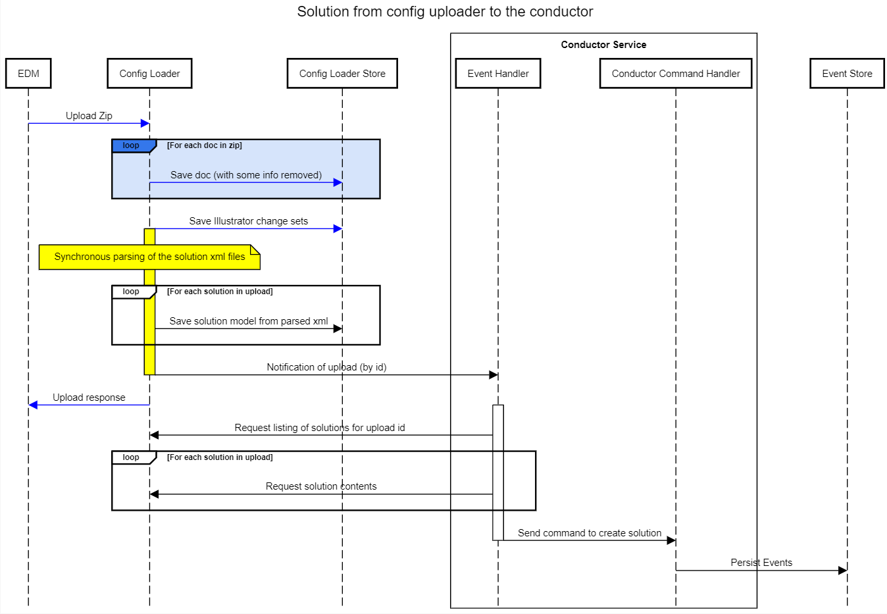
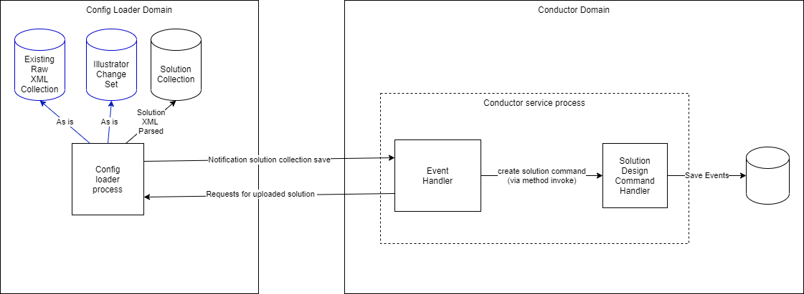

# 1. Persisting solutions from the EDM config loader

Date: 2021-03-17

## Status

Implied by whether merged to master

## Context

Solutions are uploaded to the config loader, this data is needed by the conductor in order to run legacy solutions

## Decision

The EDM config loader's current behavior highlighted in blue will remain unchanaged. The linear and synchronous workload will be extended to process the solutions as well as the illustrators. 

EDM config loader will notify any subscribers that an upload has taken place once the solution model has been saved. This will allow an Event Handler in the conductor domain to retrieve the solutions and transform them into commands for the conductor. The conductor will use the commands to create and persist event sourced aggregate roots.

The decision regarding what persistence technology the event store will use can be deferred, the appropriate abstractions will be used to support MongoDB, DocumentDB and Postgres APIs.

[View larger image](0001-assets/sequencev4.png)

A c4 style diagram showing domains, services, and components involved in this decision

[View larger image](0001-assets/domainsv4.png)

## Consequences 

Here are are the key non-functional changes required to support this decision

Identity Service:

1. New client needs to be added to allow secure communication between config loader and conductor

Config loader:

1. New controller/routes to allow listing and retrieval of solution models.
3. Interaction with Conductor Event Handlers via message bus.

Conductor:

1. A new dependency on RabbitMQ will be required
2. Dependency on permission service needed for communication with config loader