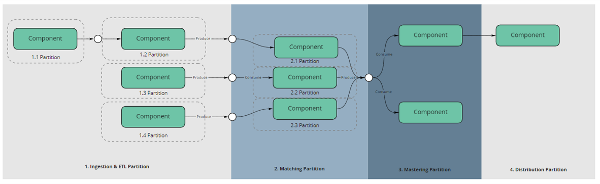

# Architecture

  

## High-level Architecture: Service-Oriented, Event-Driven

The existing EDM is a monolithic, single tenant system that performs the majority of data processing using batch-based components that are stateful and predominantly operate within a single SQL instance. This has the following limitations:

1. The volume of data that can be processed, and the throughput times achieved, is limited to the capacity of the single SQL instance. 

2. There is no shared utilisation of compute resource.

3. Each instance requires a number of always-on services with large amounts of data in memory.

In order to address these limitations, the new EDM architecture will be designed to distribute the processing across multiple asynchronous services. This provides the following mitigations to the limitations listed above:

  
Greater Scalability:

- Distribute the processing over multiple services

- Stateless services may be scaled up to multiple instances to accommodate greater workloads by processing a single record vs an entire batch
  

Better utilisation and elasticity:

- Participating services may be provisioned and torn down, or scaled up/down based on processing loads as per point above

Breaking down the monolithic app to enable:

- Greater composability of EDM and it's function, for example introduce a component to provide a specific function like regulation

- Faster release cycles on the constituent services that make up EDM

- Concurrent processing conducted by asynchronous services

Migration strategy away from EDM Classic

- The legacy EDM and it's existing processing components will be reduced to just one of the data processing services.
  
  

## Why Event Driven Architecture?
  
Given this proposed solution entails data processing that is conducted over several distributed services, the new architecture will require a design to orchestrate an end-to-end processing job. This is implemented by ensuring services are asynchronous and emit events to indicate a change in state or produce results, combined with the [Saga pattern](https://microservices.io/patterns/data/saga.html) to monitor these events to manage the state of the end-to-end pipeline by observing events emitted from the participating services.
  
Additionally, provided published events are persisted, the event-based architecture described here also enables services to stop and later resume without missing messages. This can aid recovery from failure scenarios and support producers and consumers having different lifecycles. Both of these factors enable a resilient, fault-tolerant system that may implement several different strategies for recovering from failure and outages. Furthermore, this also provides time-travelling previous messages to support activities like diagnosing a component or running what-if scenarios on past messages. These are important considerations for the re-design of EDM and the transition from a monolithic architecture to a distributed system.
  

## Components
The Conductor has been designed using Domain Driven Design principles whereby the Domain is the core of the system that encapsulates the Conductor's business logic. The lowest level building block in the Conductor Domain model is the Component abstraction. A component is a logical processing unit that consists of:
* one or more data inputs
  
* a function to be performed on the data input to give a result or set of results
  
* schema definitions for the data inputs and outputs
  
* a partition (see section below)
  

  

The diagram below is the `Component` class model
  

  

Concrete components will be created for different use-cases. These include, but are not limited to:

<table>
  <tbody>
    <tr>
      <th "text-align:left">Component Type</th>
      <th "text-align:left">Description</th>
    </tr>
    <tr>
      <td>Logic Components</td>
      <td>
        <ul>
          <li>Run a set of business logic expressions</li>
          <li>Multiple expressions combined into a single execution</li>
          <li>Expressions provided by business user, applied on data dictionary entities</li>
        </ul>
      </td>
    </tr>
    <tr>
      <td>External Components</td>
      <td>
        <ul>
          <li>Invoke an external service (eg Core Matcher)</li>
          <li>Move send data to service and co-ordinate result</li>
        </ul>
      </td>
    </tr>
    <tr>
      <td>Specialist Components</td>
      <td>
        <ul>
          <li>Perform a specific task, not end-user business logic</li>
          <li>Matching and Mastering</li>
          <li>File handling</li>
        </ul>
      </td>
    </tr>
    <tr>
      <td>Aggregate Components</td>
      <td>
        <ul>
          <li>Aggregate up constituent components</li>
        </ul>
      </td>
    </tr>
  </tbody>
</table>
 

## Combining Components to Form a Solution
Components can be combined to build up an overall data processing solution. Components may be connected up in a solution graph where the outputs of one component form the inputs to the next component(s).

 

## Partitioning Solutions for Scale
The **partition** property of a component allows the solution to define components that run together (ie inside a single process boundary) or on separately hosted services. This allows for splitting a data pipeline into segments where multiple instances of a component can run as separate concurrent workers, following the [competing consumers](https://medium.com/event-driven-utopia/competing-consumers-pattern-explained-b338d54eff2b) pattern.

## Conductor Sagas - Monitoring Solution Execution State

The Saga is the orchestrator of an EDM solution.  It is responsible for creating the worker processes that will host partitioned components.  It will orchestrate the running of components as defined by the solution graph, tracking component progress, making branching decisions, handling failures, publishing observability events, and finally ensuring workers are terminated.

## Note on open source workflow libraries and frameworks

We evaluated Argo workflow and a number of other open source libraries highlighted on the [awesome-workflow-engines github page](https://github.com/meirwah/awesome-workflow-engines).

