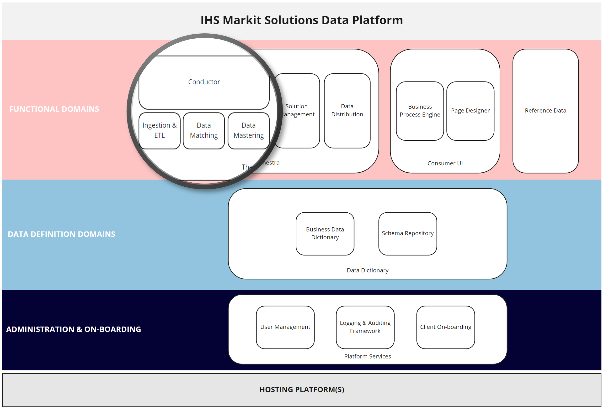

# Concepts and Architecture

## Introduction
One of the key aspects of the vision behind the EDMC project is the ability to cater for ever-increasing data volumes greater than what the current product is capable of handling. This entails:
  
* the ability to scale-out data processing jobs across a distributed architecture 
  
* move toward multi-tenant SaaS solution that utlises elastic cloud infrastructure and enables greater resource utilisation
  

The Conductor is a sub-system of EDM that is responsible for executing the data processing jobs. Therefore, it's architectural design has been devised to meet these needs.

The Conductor's role is to load data processing solutions that have been designed by our clients, along with the schema of the underlying data model, and provision the necessary resources to execute that solution. Therefore, it can be considered as an orchestrator of end-to-end data processing pipelines. Given that it oversees the data processing, in addition to meeting the objectives above, it is also responsible for:
  
* handling and managing failure during long-running data processing jobs
  
* capturing the data-lineage generated by the steps or sub-components that make up data processing pipelines
  
* ensuring that the resulting data sets comply with the clients' data schemas
  
