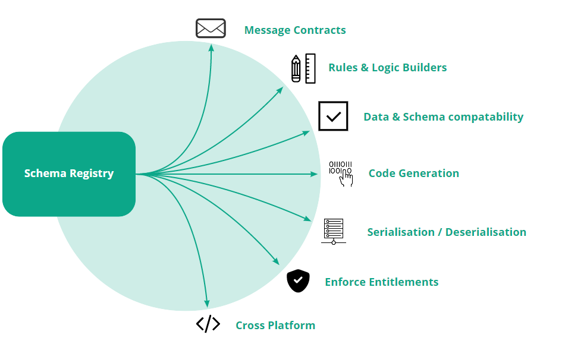

# Conductor Technology Choices

  

The sections below outline the infrastructure required to support the core domain model. Each section outlines the requirements for the given infrastructure concern, the technology options and choices, and any technology decisions reached. If you haven't already done so, please see the [Architecture section above](./Architecture.md), which provides important context for those requirements.

  

## Important Note on Conductor Architecture Design and Infrastructure

The Conductor has been designed following the pattern of [hexagonal architecture](https://blog.octo.com/en/hexagonal-architecture-three-principles-and-an-implementation-example/). Therefore, the following infrastructure concerns exist to support the domain model. Under no circumstances should the Conductor Domain model depend on the infrastructure. This ensures that whilst the technology choices below are important, high cost and high implication decisions, the technology choices can be changed without impacting the core Domain model.

## Persistence

Solution and Saga state are persisted as a log of events to a document store.  This provides an immutable history of change over time and avoids update concurrency issues.  The current store in the cloud is DocumentDB(MongoDB on-premise), although we are also considering evaluating Postgres.

We are also considering storing mastered data records as documents with an associated event log to provide a complete lineage of how the master was derived from the source.  The store technology has yet to be decided on. However, the current candidates are DocumentDB and Postgres.

Hexagonal architecture has been applied, so the actual "adapters" can be swapped out easily.

## Messaging Infrastructure

The Conductor requires the following aspects from the supporting messaging infrastructure:

* Create topics on demand before executing a processing pipeline to create the integrations between distributed components and the orchestrating sagas
  
* Allow for multiples workers to consume messages from the same topic and multiple producers to produce onto the same topic
  
* Consumers that do not process messages as fast as they are produced should not interrupt the upstream components
  
* Distributed Producer and consumer components are prone to failure, and the design should anticipate that. The messaging infrastructure needs to enable different modes recovery and failure strategies to deal with failure gracefully based on the requirements of the individual components. This may, for example, entail replaying messages or the use of dead-letter queues.
  
* It must be feasible to host the messaging infrastructure both on the cloud SaaS offering as well as on-premise
  
* Append only topics that preserve the ordering of messages as they are produced by components
  
* Persistene of messages to a durable store to allow applications to stop and later resume without missing any messages
  

Desirable

* Provide the ability to scale nodes on demand up. Most of the current data processing jobs carried out by EDM clients is overnight-processing
  
* A supported mechanism for segregating messages can be segregated by a tenant
  
* Support partitioning of messages to scale up to larget data processing jobs
  
* Configurable TTL period for messages to enable debug and diagnostics, and the ability for users to replay events in what-if scenarios (ie developing and configuring components in their solutions)

For the reasons listed above, a log-based message broker is preferred to a pure queue-based messaging system where messages are natively transient. The two most prevalent event log messaging systems in the industry are Apache Kafka and Apache Pulsar. However, Pulsar has the following features relevant to the requirements above, which make it the preferred candidate:

1.  **Multi-tenancy**
Pulsar has been designed with multi-tenancy in mind. Not only can messages be easily segregated by tenant using the native URL structure, but tenants may have their own policy and configuration. On the first point, we foresee challenges and complexity where we need to partition messages based on volume and segregate messages per tenant. See [here](https://pulsar.apache.org/docs/en/concepts-multi-tenancy/) for more information on Pulsar's design and features to cater for multi-tenant systems.
  
2.  **Stateless brokers**
Given that pulsar's brokers are stateless, it means they can be scaled up on demand. This provides greater elasticity, which is a key feature given the nature of EDM usage.
  
3.  **Tiered Storage**
Pulsar has a [tiered storage](https://pulsar.apache.org/docs/en/concepts-tiered-storage/) capability to archive older messages to cheaper storage once they are no longer being processed by consumers. Given that longer retention of log events emitted during the data processing jobs can provide a rich insight into historical data processing runs, this is an attractive feature that comes with the product.
  
4.  **A simpler C# Client Library**
EDMC will be built in C#, as that is the core server-side technology in the EDM Development group. Based on our analysis to date, we found the C# developer experience with Pulsar to be easier than past experience with Kafka.
  
5.  **Support for Message Queue Patterns**
Whilst Pulsar is primarily a log-based messaging infrastructure, it also supports standard message queuing patterns without any additional packages or libraries (see more information [here](https://pulsar.apache.org/docs/en/concepts-messaging/)).
  

### **Risks, Operating and support**

The risks associated with Pulsar are as follows:

1.  **Hosting Pulsar**
We are required to host the messaging infrastructure both on-premise and on the cloud. On that requirement, Pulsar is no simpler to host than Kafka; arguably, it is more challenging. Like Kafka, it depends on Apache Zookeeper for configuration and cluster management. It also depends on [BookKeeper](https://pulsar.apache.org/docs/en/administration-zk-bk/#docsNav) to manage persistent storage. See more information on the supporting administration tools [here](https://pulsar.apache.org/docs/en/administration-zk-bk/#docsNav). To address the hosting, all infrastructure will be managed using infrastructure as code from the very outset. This is currently managed in the [Conductor IAC repository](https://git.mdevlab.com/medm/team-conductor/conductor-iac) on GitLab.
  
2.  **Product Maturity**
Given that Pulsar is a high-cost architectural decision, and we have limited experience with the product. The Conductor architecture has been built to keep infrastructure decisions abstracted from the core domain. However, the messaging infrastructure is likely to be the most pervasive of the tech choices. We will remain vigilant that the domain remains agnostic of the messaging infrastructure to ensure that if Pulsar proves to be incompatible in the early phase of development, it can be replaced.
  
3.  **Managed Services Support** As noted above, Pulsar is a new technology that brings an element of risk to supporting it in a production environment. The mitigation is to bring a member of the Managed Ops team across to join our own DevOps group early in the project lifecycle. Additionally, the monitoring and observability of the environment will be built out early in the project lifecycle using the same IAC repository highlighted above. This monitoring infrastructure should also be used in performance testing scenarios to build up the maturity with the Ops team well before we are considering production releases.
  

## Schema Management

Schemas will play a significant role across the entire EDMC application. The reason being is that EDMC is agnostic of the data model that end-users ultimately want to manage in their solution. The Data Dictionary sub-domain will provide a web app and backend service to enable end-users to define their data models, express relationships between entities, augment with meta-data such as glossary terms, and manage access rights.

These schemas need to be published so that the Conductor, the components it runs, and the business logic configured by the users can all be validated against the schema they are operating on. These schemas need to be machine readible and provide the ability to check compatibility with one another. Therefore, the intention is to use a central schema repository that will maintain versioned copies of all schemas in a format that can be consumed by the Conductor to execute solutions and during the design experience when building solutions.

The current choice of technology to represent those schemas is Apache Avro. The primary drivers behind this choice are as follows:
* Schemas are represented in JSON format, which is easily consumed by other dependent applications
  
* Can be used for message serialisation
  
* Has C# and JavaScript libraries, the two main technologies used by our development teams. Both of which support code-generation
  
  

## Container Orchestration & Hosting
  

EDMC is currently being developed to run on EKS in AWS. This is part of a broader architectural decision that impacts the EDMC platform as a whole, of which the Conductor is one of the sub-domains.

  

Currently, we have not established the requirements for hosting ephemeral services or components that makeup data processing solutions. The early outlook is that we will use K8's as the container orchestration tool to manage transient workloads. This will be explored further down the roadmap when we start to build out the requirement in more detail.

  
  

## Complimentary Tools

## 4Logik

[4Logik](https://4logik.com/) is a tool that provides and IDE-like experience for business users to build business logic and algorithms on their own data model using a no-code, rich GUI. It enables business users to build and test their logic using a rich web application and use code-gen to build and compile resulting artefacts. There is synergy with the EDMC product as it will help establish low-code / no-code UI's aimed at business people to maintain the logic they want to run in their data processing pipelines. The Conductor can then embed the resulting artefacts inside components that the Conductor can execute.

This is at a very early PoC stage. More information will follow after some further effort to trial integrating with the artefacts built using the product for a specific use case.